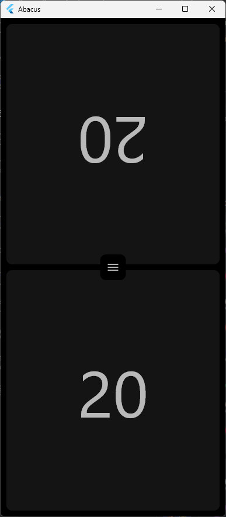
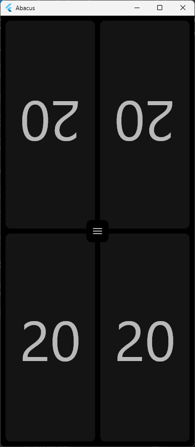
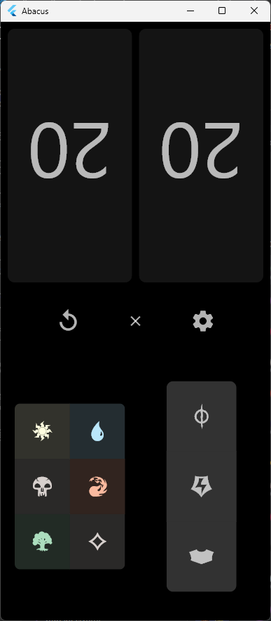
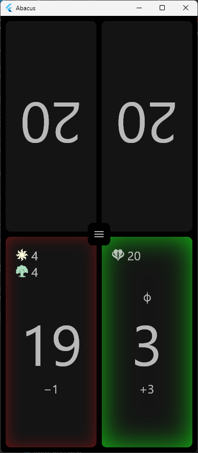
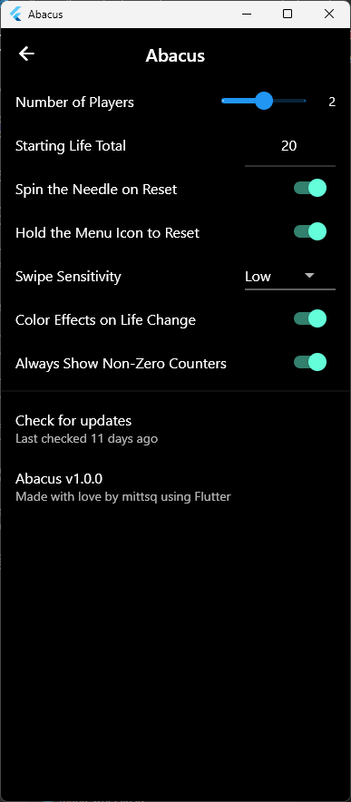

# Abacus

A simple counting app for tabletop games such as Magic: The Gathering.
Abacus attempts to combine the best features of other life counters while leaving out the worst features, all while looking pretty in the process.

## Features

* Tap or swipe to modify counters.
* Counters for life, mana, and more.
* Two- and four-player modes.
* Portrait and landscape support.
* A spinner to decide who goes first.
* Fancy color effects.
* Options to enable only what you need.
* Support for literally every relevant platform.

## Changelog
### v1.0.2
* Fixed some web-related bugs.
  * Wakelock library needs time to initialize.
  * Odd bug with `shared_preferences` and nullable primitives caused Settings to crash.

### v1.0.1
* Small changes related to async presentation.

### v1.0.0
* Initial release!

---

## Screenshots
### Main counter screen at 2 and 4 players

### Expanded menu with mana and other counter buttons visible

### The settings screen

